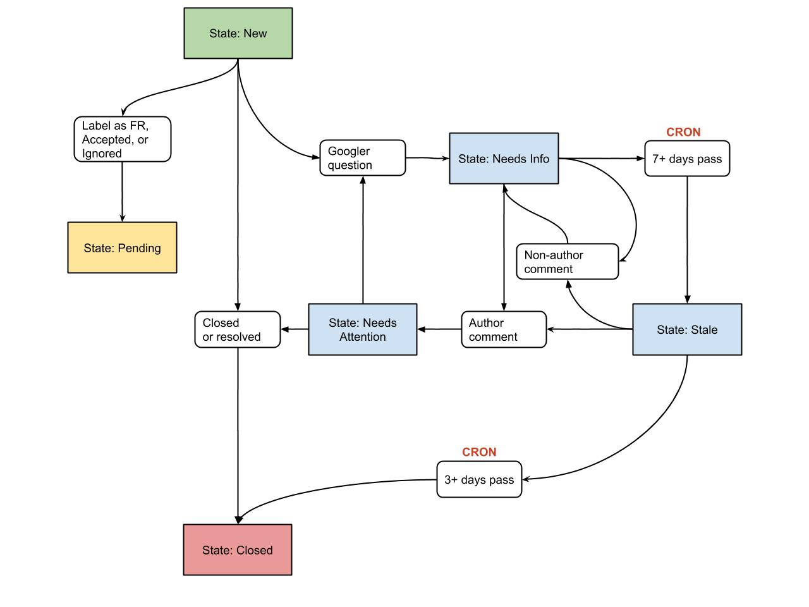

# Firebase OSS Robot

## Introduction

A robot to make open source easy for Firebasers.  The robot has multiple
distinct features which can be enabled individually.

### Custom Emails

In shared repos you may only want to receive email notifications for a subset
of the events that are fired. The bot allows you to specify a specific email
address for each label and then you will only receive emails for issues/PRs
with that label:

```javascript
// In this example, the engineers on the 'foo' team will get emails
// about issues labeled 'foo' and the engineers on the 'bar' team
// will get emails about issues labeled 'bar'
"my-repo": {
  "labels": {
    "foo": {
      "email":"foo-engineers@googlegroups.com"
    },
    "bar":{
      "email":"bar-engineers@googlegroups.com"
    }
  }
}
```

### Issue Labeling

The bot can automatically label incoming issues based on regex matching:

```javascript
"my-repo": {
  "labels": {
    "foo": {
      "regex":"Component:[\\s]+?[Ff]oo",
      "email": // ...
    },
  }
}
```

In the example above, an issue that contains "Component: foo" or "Component: Foo" or
any variation would automatically get the "foo" label.  When combined with the custom
emails configuration above, this means the bot can auto-label and then auto-notify the Foo
engineering team about new issues or issue events.

If bot can't find a label for an issue, it will add the label `needs-triage` and then
add a comment explaining to the developer that a human will come to help.
 
### Template Matching

If you use issue templates on your GitHub repo, the bot can enforce that new issues
match the template.

Issue templates are considered in "sections" where each section is a third-level header,
denoted in markdown by `###`.  For example:

```md
### Are you in the right place?

Are you using FooBar Engineering products?  If not, go away!

### [REQUIRED] Describe your environment

  * FooBar SDK Version: ____
  * Operating System: ____

### [REQUIRED] Describe your problem

  * What are the steps to reproduce?
  * What do the logs say?
```

The bot does checks at two levels:

  * **Template Integrity** - did the developer filling out the template leave all the
    headers in place?  If not, we can't easily parse the content.
  * **Required Sections** - for any section marked with `[REQUIRED]` did the developer
    make at least _some_ change to the content of the section?

If the user violates either of the above checks, the bot will leave a comment
telling them what they may have done wrong.

If your issue template is located at `ISSUE_TEMPLATE.md` then the bot will
know where to find it without any configuration. If you want to specify a different
location for your template, add it to the config:

```javascript
"my-repo": {
  // ...
  "templates":{
    "issue":".github/ISSUE_TEMPLATE.md"
  }
}
```

If your repo has multiple templates (like one for bugs and one for features) you must
add a markdown comment to the template to let the robot know how to locate it:

```md
<!-- DO NOT DELETE 
validate_template=true
template_path=.github/ISSUE_TEMPLATE/bug.md
-->

### My first section
...
```

#### Template validation

You can configure how the required sections of an issue template are validated and whether/which label is added to the issue in case of a violation:

```
"validation": {
  "templates": {
    ".github/ISSUE_TEMPLATE/bug.md": {
      "validation_failed_label": "need more info",
      "required_section_validation": "relaxed"
    },
    ...
  }
}
```
There are three different levels of required section validation:

- `strict`: Any empty required section is a violation
- `relaxed`: As long as one required section is filled, it's ok
- `none`: No validation of required sections

### Stale Issue Cleanup

The bot can help you clean up issues that have gone "stale", meaning that
more information is needed but has not been provided.

The flow is described in this chart:



The names of the labels and the length of certain time periods can
be configured in your repo config:

```javascript
"my-repo": {
  // ...
  "cleanup": {
    "issue": {
      // [REQUIRED] Label manually applied for issues that need more information.
      "label_needs_info": "Needs Info",

      // [OPTIONAL] Label to be applied for issues that need Googler attention.
      // If unspecified, this state will not have a visible label.
      "label_needs_attention": "Needs Attention",
 
      // [REQUIRED] Label to be applied for issues that don't have recent activity
      "label_stale": "Stale",

      // [OPTIONAL] Label(s) that can be applied to issues to exempt them from the stale
      // checker.
      "ignore_labels": ["Feature Request", "Internal"],

      // [REQUIRED] Time, in days, to stay in the needs_info state before becoming stale
      // stale.  These issues transition from label_needs_info to label_stale.
      "needs_info_days": 7,

      // [REQUIRED] Time, in days, to close an issue after the warning message is posted
      // if there is no recent activity.  These issues will transition from
      // label_stale to closed.
      "stale_days": 3,

      // [OPTIONAL] Time, in days, to lock an issue after it has been closed.
      "lock_days": 60
    }
  }
}
```

### Old Issue Locking

The bot can lock issues that have been closed for a while to prevent new discussion. 
To enable this, add the `lock_days` key to your "stale issue config" (see above).

### Repo Reports

The bot can send you a weekly report of how healthy your repo is. To receive this
report, just add a reporting config:

```javascript
"my-repo": {
  // ...
  "reports": {
    "email": "foo-engineering@googlegroups.com"
  }
}
```

You will then receive a weekly email with:

  * Change in open issues, stars, and forks.
  * List of which issues were opened in the past week.
  * List of which issues were closed in the past week.

## Monitoring

The bot keeps a log of visible actions it takes on GitHub, which you can view on
a per-repo basis:

https://ossbot.computer/audit.html?org=ORG_NAME&repo=REPO_NAME

## Deployment

### Deploy Functions, Configuration, and Cron Jobs

After completing all configuration below, run `make deploy`.

### Customize Configuration

Edit the `functions/config/config.json` file to have configuration in the following form:

```javascript
{
  "<ORG_NAME>": {
    "<REPO_NAME>": {
      // .. REPO CONFIGURATION ...
    }
  }
}
```

See the feature sections above for the different properties that can be added to the
repo configuration.

### Configure Secrets

#### GitHub:

Go to the [github token page](https://github.com/settings/tokens/new) and
create a new personal access token for the bot account with the following
permissions:

  * `public_repo` - access public repositories.
  * `admin:repo_hook` - read and write repository hooks.

```
firebase functions:config:set github.token="<YOUR_GITHUB_TOKEN>"
```

#### Mailgun:

```
firebase functions:config:set mailgun.key="<YOUR_MAILGUN_KEY>"
firebase functions:config:set mailgun.domain="<YOUR_MAILGUN_DOMAIN>"
```

### Email

In order to use the `SendWeeklyEmail` endpoint you need to configure the
recipient to some public group.

```
firebase functions:config:set email.recipient="<GROUP_TO_GET_EMAILS>"
```

#### Configure GitHub Webhook

In GitHub add a webhook with the following configuration:

  * Payload URL - your cloud functions HTTP URL. Which should be
    `https://<YOURPROJECT>.cloudfunctions.net/githubWebhook`.
  * Content type - application/json
  * Secret - N/A
  * Select individual events:
    * Issues
    * Pull request
    * Issue comment

## Development

### Test

To run basic tests, use `make test-functions` which runs the mocha tests the `functions`
directory. These tests are mostly a sanity check, used to verify basic behavior without
needing an end-to-end deploy.

### Formatting

Code is formatted using `prettier` so no bikeshedding allowed. Run
`npm run build` in the `functions` directory before committing.

## Build Status

[![Actions Status][gh-actions-badge]][gh-actions]

[gh-actions]: https://github.com/firebase/oss-bot/actions
[gh-actions-badge]: https://github.com/firebase/oss-bot/workflows/CI%20Tests/badge.svg
